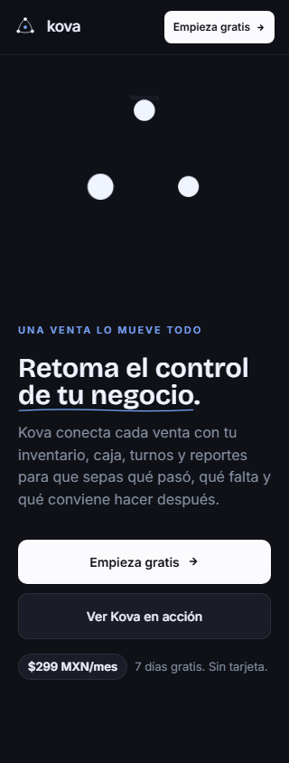
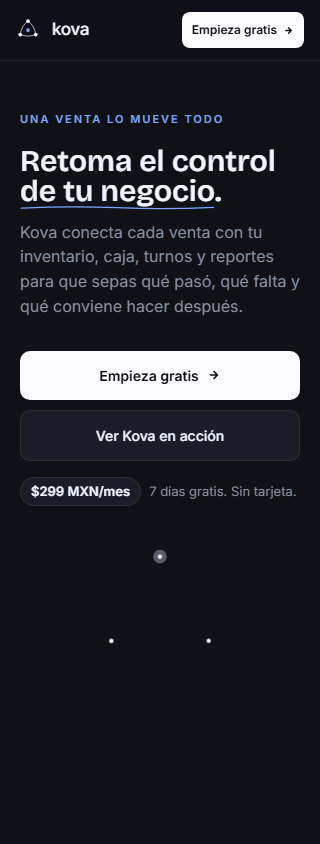
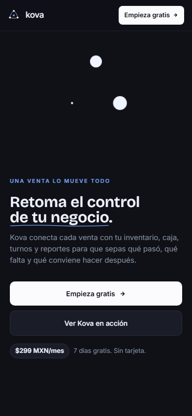
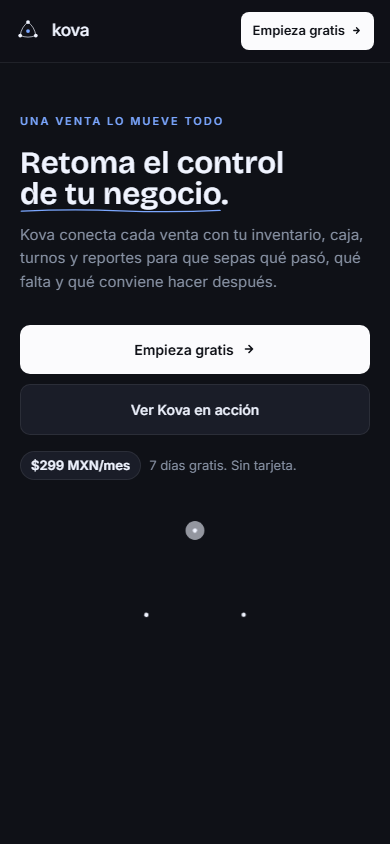

# Evidencia CRO-1 — Home y demostración mobile

Estado: **implementación candidata; pendiente de Lighthouse en Vercel Preview y CI del PR**.

## Cambio observable

En 320×844 y 390×844 el primer viewport ahora presenta la promesa y la acción antes de la
animación de marca. `.lp-hero-grid` dejó de participar en el reveal con opacidad/blur y la animación
interna permanece pausada hasta que Home completa el montaje. En mobile se usa la tipografía del
sistema para evitar descargas y swaps antes del LCP; las secciones inferiores conservan todo su HTML
prerenderizado pero difieren layout/paint con `content-visibility`. `prefers-reduced-motion` conserva
el estado estático.

| Antes — producción | Después — branch local |
|---|---|
|  |  |
|  |  |

## CTA y experimento

- Home entrega al showcase el mismo destino: `/signup` anónimo y `/dashboard` autenticado.
- El showcase standalone conserva `/signup` por defecto.
- Los clics embebidos reportan `cta=showcase`.
- EXP-01 está preregistrado en
  [`docs/experiments/EXP-01-CTA-SPECIFICITY.md`](../experiments/EXP-01-CTA-SPECIFICITY.md).

## Validación previa al PR

- Vitest focal: 20/20.
- Playwright mobile: 6/6 en Chromium y mobile-chrome, cubriendo 320×844, 390×844, 430×932,
  768×1024, Home→signup y reduced motion.
- El HTML prerenderizado difiere la descarga de React 750 ms mediante un bootstrap externo
  compatible con CSP; el shell autenticado conserva su carga inmediata. Dos pruebas focales SEO
  verifican el HTML y su hidratación.
- Typecheck, ESLint y build con prerender: verdes.
- Sin overflow horizontal; H1, soporte y CTA aparecen antes que `.lp-hero-visual`; el CTA queda
  dentro del primer viewport en 320×844 y 390×844.

## Gate de performance

El baseline de producción previo es LCP mediano 2.509 s. El primer artefacto del PR (`0d78e41`)
falló correctamente el gate con LCP 3.063 s; su desglose señaló 651 ms de retraso de render del
hero. Después de sacar fuentes, secciones inferiores e hidratación del camino crítico, el candidato
final obtuvo Performance 100, FCP 1.207 s, LCP 1.357 s, TBT 3 ms y CLS 0 en Vite Preview local.

La aceptación exige tres corridas mobile contra el nuevo artefacto servido por Vercel Preview:
mediana ≤2.2 s y ninguna >2.5 s. No se fusiona el PR hasta completar este gate; la medición local
sirve como diagnóstico, no sustituye la red/CDN del artefacto de despliegue.

## Rollback

Revertir el commit de CRO-1 restaura el orden y reveal previos. No hay cambios de backend, auth,
RLS, billing, tenant ni esquema. El PR abierto #47 también toca Home/landing; debe rebasarse después
de CRO-1 y resolver sus animaciones sin reintroducir `order: -1` ni el reveal del hero.
