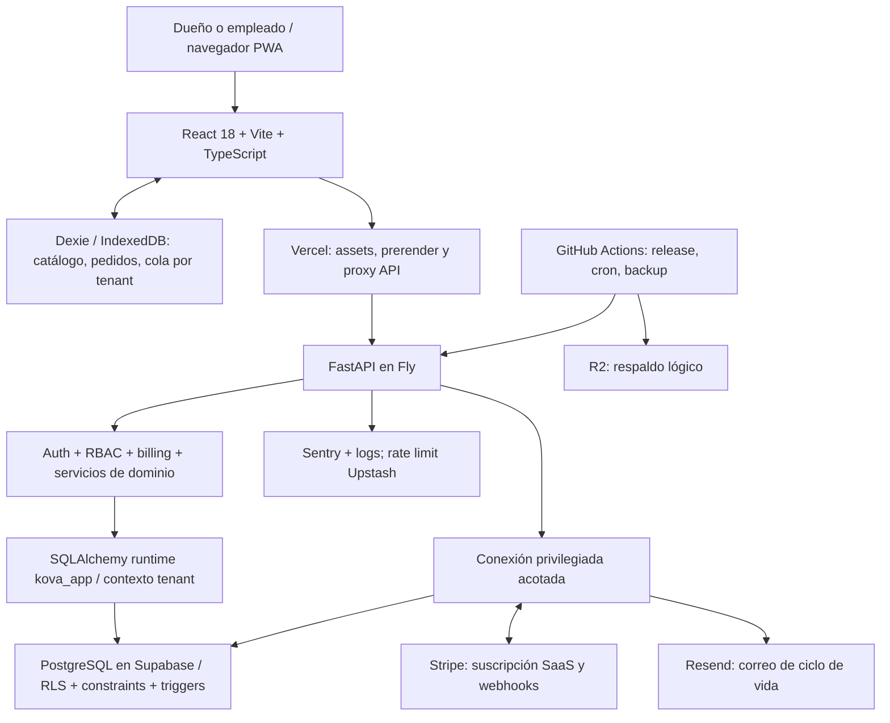

# KOVA SYSTEM HEALTH

**OVERALL HEALTH SCORE: 51/100. Recomendación: mantener beta controlada; corregir integridad y continuidad antes de ampliar clientes.**

Auditoría del commit `837cf3f21c8b511aedf91b70ba61484fc08dee1f`, realizada el **6 de septiembre de 2026, America/Mexico_City** (algunas ejecuciones corresponden al 7 de septiembre UTC). Revisión de producto, arquitectura, código, contratos, migraciones, pruebas y operación declarada. No es certificación de seguridad ni constatación de incidentes productivos. No se modificó implementación, tests, contratos, migraciones ni configuración; sólo documentación de auditoría.

Kova tiene una base valiosa: monolito modular, dinero Decimal/Numeric, UUID durable para ventas, ledger de inventario, sesiones verificadas contra DB, rol runtime separado, RLS, snapshots, pruebas y release gates. Los defectos prioritarios aparecen **entre transacciones, permisos efectivos, reintentos, pestañas y cierres**. Más features o una reescritura no resuelven esos problemas.

| Area | Score /5 | Risk | Summary |
|---|---:|---|---|
| Architecture | 3.5 | Medio | Monolito adecuado; commits en servicios rompen composición de casos de uso. |
| Code Quality | 3 | Medio | Código legible y checks presentes; duplicación de idempotencia y archivos extensos. |
| Security | 3 | Alto | Cookies/CSRF y revocación sólidos; export Ops y parámetros en logs abren otras fronteras. |
| Multi-tenancy | 3 | Alto | Buen aislamiento ordinario; ciclo RLS y coherencia entre cookies y pestañas incompletos. |
| Database | 2.5 | Alto | Constraints e inmutabilidad útiles; upgrade poblado falla y faltan FKs tenant compuestas. |
| POS Correctness | 2 | Alto | Dinero exacto; sobredevolución de unidades, carreras y retries de caja no seguros. |
| Offline Sync | 2 | Alto | Cola durable y leases; lote RLS, reintento agotado y arranque frío fallan. |
| Edge Case Resilience | 2 | Alto | Tests de componentes omiten combinaciones que ya se pudieron reproducir. |
| Reliability | 2.5 | Alto | Health y recuperación parcial; restore real sigue pendiente y release tiene huecos. |
| DevOps | 3 | Alto | CI, digests y SBOM; migraciones pobladas y recuperación por fase incompletas. |
| Testing | 3 | Alto | 619 backend verdes no detectan los fallos reproducidos con commits/roles reales. |
| Observability | 3 | Medio | Logs correlacionados y Sentry; faltan SLIs de negocio y saneamiento exhaustivo. |
| Performance | 3 | Medio | Lazy chunks/prerender; consultas por fila y materialización de reportes. Sin carga medida. |
| UX | 3 | Alto | Español y salvaguardas presentes; actualización/reintento pueden interrumpir caja. |
| Product | 3.5 | Medio | Propuesta clara; confianza en cifras y recuperación importa más que ampliar funciones. |
| Privacy | 2 | Alto | Borrado/export implementados pero incompletos para relaciones e información interna. |
| Cost Efficiency | 3 | Medio | Stack razonable; sin facturas/volumen para validar costos efectivos. |
| Developer Experience | 3 | Medio | Locks/scripts presentes; OpenAPI desactualizado y documentación activa dispersa. |

Ponderación explícita, no promedio simple: arquitectura 4%, calidad 3%, seguridad 10%, tenants 12%, DB 10%, POS 16%, offline 13%, bordes 9%, fiabilidad 7%, DevOps 4%, testing 3%, observabilidad 2%, performance 2%, UX/producto/privacidad/costo/DX 1% cada uno. `Σ(peso × score/5)=51.2`, redondeado a **51**. Es un juicio de preparación sustentado en evidencia, no una probabilidad de fallo; los ámbitos operacionales no observados conservan incertidumbre.

## Alcance, método y trazabilidad

Se inspeccionaron AGENTS.md/CLAUDE.md, reglas `.claude/rules`, README, contextos de producto/arquitectura, checklists QA/GA, sprint actual, planes de remediación, ADRs, specs/OpenAPI, manifests/locks, módulos frontend/backend, migraciones hasta 0062, workflows, runbooks y pruebas relacionadas. Las auditorías anteriores son antecedentes, no prueba de cierre de los escenarios nuevos.

Los archivos ajenos ya presentes en `output/`, `tmp/` y `videos/` no forman parte del runtime SaaS auditado y se conservaron. No se leyeron `.env`, credenciales, logs productivos ni paneles autenticados de proveedores. Sólo hubo GET a las páginas públicas solicitadas. La configuración efectiva de Supabase/Fly/Vercel/Stripe, branch protection, backups, alertas y correo sigue **NEEDS VERIFICATION**.

Tres frentes paralelos, autorizados por el usuario, aportaron revisiones especializadas; el coordinador contrastó las conclusiones y ejecutó pruebas POS y suite global. Evidencias complementarias, parte de esta auditoría:

- [POS: código y resultados de reproducciones](evidence/POS_REPRODUCTIONS.md).
- [Auth, billing y privacidad](evidence/BILLING_AUTH_PRIVACY_REVIEW.md) y [reproducciones](evidence/BILLING_PRIVACY_REPRODUCTIONS.md).
- [Datos, migraciones, RLS, pedidos y fiscal](evidence/DATA_REPORTS_REVIEW.md), incluyendo inventario completo de policies autoradas.
- [Plataforma, producto, frontend y sitio público](evidence/PLATFORM_PRODUCT_REVIEW.md).
- [Backlog listo para tareas individuales](KOVA_IMPROVEMENT_BACKLOG.md).

Las referencias `ruta:línea` son posiciones del commit auditado, relativas a la raíz. **HIGH** = camino comprobado y/o reproducción; **MEDIUM** = interacción plausible con condiciones sin reproducción integrada; **LOW/NEEDS VERIFICATION** = falta evidencia externa. Un test existente no significa necesariamente test ejecutado ni garantía de producción.

## Validaciones ejecutadas

La copia desechable se generó con `git archive HEAD`, sin `.env`. PostgreSQL 17.10 escuchó exclusivamente en `127.0.0.1:55469`; se usaron bases separadas para suite, POS, migración y privacidad. Ninguna migración se ejecutó contra una base real del producto. Python 3.12.2, Node 24.14.0, npm 11.9.0. Los paquetes instalados del backend comparados con `uv.lock` no mostraron diferencias; además `uv sync --frozen` instaló correctamente 60 paquetes en otro entorno desechable. CI usa PostgreSQL 16: reproducir los nuevos escenarios allí también.

| Check | Resultado | Interpretación |
|---|---|---|
| `ruff check .` backend | PASS | Sin incidencias estáticas. |
| `pytest` sin alterar tests, copia aislada | **619 passed**, 261 s, 3 warnings | Incluye SQL real; la mayoría usa owner y SAVEPOINT externo. No prueba toda la operación como runtime. |
| `npm run lint` / `typecheck` | PASS | No garantiza corrección de flujos. |
| `npm run check:api-contract` | PASS | Compatibilidad de DTOs críticos contra archivo versionado. |
| `python scripts/export_openapi.py --check` | **FAIL** | Archivo versionado omite campos/rutas fiscales nuevos; distinto alcance al check frontend. |
| `npm test -- --run` | **494 passed, 2 failed**, 108 archivos | Fallos en App login y selección de pago de pedido. |
| Reejecución sólo de esos dos archivos | **9 passed** | Inestabilidad/aislamiento/tiempo pendiente; no reescribir expectativa para ocultarla. |
| `npm run test:release-contract` | 2 passed | Verifica metadata de release, no toda promoción/rollback. |
| `npm run build` | PASS | Cliente, SSR y prerender de cinco rutas. |
| `npm run check:bundle-secrets` | PASS, 89 JS | Sin patrones prohibidos; no constituye escaneo integral de historial/credenciales. |
| `npm audit --omit=dev --audit-level=high --package-lock-only` | PASS, 0 vulnerabilidades informadas | Dependencias runtime npm, a fecha de ejecución. |
| `uv run --frozen --with pip-audit pip-audit` en entorno desechable | PASS, sin vulnerabilidades conocidas informadas | Versiones del lock instaladas; resultado puntual, no promesa futura. |
| `check_ops_readiness.py repository` + unittest scripts | PASS, 9 tests | Contratos locales; no demuestra restore/inbox/monitores efectivos. |
| Playwright mocked sobre preview del build, 2 workers | **137 passed, 7 failed, 3 skipped**, 147 tests | Fallos de skip-link, búsqueda, PWA, ordenamiento y SEO/hidratación; revisar compatibilidad del harness con build. |
| `--last-failed` en servidor dev, configuración ordinaria | **5 passed, 2 skipped** | SEO requiere preview; no se demostró que esos dos pasen. El cambio de modalidad impide llamar al conjunto verde. |
| Integración navegador+API completa y axe real | No ejecutados localmente | Docker daemon no disponible; sus tres casos se omiten en mocked. Backend SQL sí se probó. |
| Upgrade vacío→0062 | PASS | Insuficiente para upgrade con datos. |
| Upgrade 0061 poblado→0062 | **FAIL reproducido** | Trigger immutable bloquea UPDATE; versión y datos anteriores conservados por rollback DDL. |
| Reproducciones adversas POS/RLS | **6 defectos observados** | Lote RLS, devolución repetida, movimiento en no inventariable, TTL idempotencia, doble movimiento, carrera de cierre. |
| Reproducciones frontend y billing | Defectos observados | Reintento agotado sin HTTP, SW recarga, invoice antiguo reactiva; detalles y límites en anexos. |

Warnings backend: deprecación de integración TestClient y longitud de clave **sintética de test**; no se infiere una clave productiva débil. No se ejecutó gitleaks sobre secretos/historial ni se declara ausencia global de secretos. El build local no se desplegó. No se realizaron cargos, envíos de correo ni mutaciones productivas.

# TOP 10 RISKS

Orden por impacto × probabilidad × alcance operativo ÷ costo de corrección; incluye defectos demostrados y riesgos de frontera de alto impacto. No se encontró P0 demostrado. P1 significa resolver antes de expansión, no afirmar incidente universal.

| ID | Title / Severity | Why it matters / Failure scenario | Evidence | Recommendation | Effort / Confidence |
|---|---|---|---|---|---|
| **KOV-001** | Contexto RLS desaparece entre commits — **P1** | Lote de dos ventas: primera synced, segunda DataError. Borrado/empleados también consultan después de commit. Cola/cuenta quedan en estado incierto. | `shared/dependencies.py:40`, `sync/service.py:25`, `orders/service.py:439`, `db.py:82` bajo `backend/app/`; reproducción POS real como kova_app. | Contexto por transacción validada y unidades de trabajo explícitas; probar API real con runtime y commits, sin debilitar RLS. | M / HIGH |
| **KOV-002** | Reembolso admite línea duplicada — **P1** | Venta $20, una unidad de $5: misma línea dos veces devuelve $10 y repone dos unidades. El techo por método no lo evita. | `backend/app/orders/service.py:561-589`, `orders/schemas.py:177`; DB sólo checks positivos. Reproducción 201, sold=1/refunded=2. | Rechazar o agregar líneas repetidas antes de validar cantidades acumuladas; mantener lock y techo monetario. | S / HIGH |
| **KOV-003** | Cierre no serializa escrituras de caja — **P1** | Cierre calcula $80; otra transacción añade $10; cierre congela $80 aunque ledger suma $90. Venta/refund/movimiento pueden competir. | `backend/app/shifts/service.py:209-222`, `shifts/repository.py:10-18`, `orders/service.py:353`; reproducción con dos sesiones. | Lock común del turno para todos los escritores y cierre; distinguir evento tardío offline de escritura realtime. | M / HIGH |
| **KOV-004** | Idempotencia revierte la operación dentro del helper — **P1** | Clave vencida sigue siendo unique pero get la oculta; store hace rollback y no devuelve respuesta persistida. Runtime falla; owner puede devolver 201 de fila inexistente. | `backend/app/idempotency/service.py:12-52`, `0005_audit_idempotency.py`; ambas variantes reproducidas. | Resolver identidad/claim antes del efecto, no absorber rollback global; semántica explícita TTL/replay y respuesta ganadora. | M / HIGH |
| **KOV-005** | Invoice viejo revive suscripción cancelada — **P1** | Lifecycle t=200 canceled + payment t=100 sin watermark propio → active, acceso comercial permitido. | `backend/app/billing/service.py:739-785`, `:985`; `billing/access.py:57`. Reproducción de funciones reales con proveedor simulado. | Autoridad temporal coherente para status compartido; reconciliar contradicciones entre familias. | M / HIGH |
| **KOV-006** | Migración 0062 falla con cierre existente — **P1** | UPDATE de backfill viola trigger immutable 0058; despliegue no puede avanzar sobre datos representativos. | `backend/alembic/versions/0062_accountant_close_packages.py:113`, `0058_fiscal_snapshots_global_drafts.py:383-403`; PostgreSQL local poblado. | Procedimiento de upgrade compatible con inmutabilidad; determinar estado aplicado antes de decidir reparación. Probar upgrade poblado. | S/M / HIGH |
| **KOV-007** | Export de cuenta incluye notas internas Ops — **P1** | Dueño descarga body/autor de notas internas ligadas a su negocio; filtro tenant no separa dominio público/interno. | `backend/app/account_lifecycle/service.py:27,75-113`; `0060_ops_notes_incident_states.py:28`; grants de provisioning. | Allowlist explícita de tablas/columnas exportables y grants internos mínimos. | S / HIGH |
| **KOV-008** | Purga con ventas/devoluciones falla — **P1** | Orden de DELETE viola FK; refund_items ni siquiera se descubre por carecer de tenant_id. Una cuenta bloquea lote. | `backend/app/account_lifecycle/service.py:280-306`; `0009_refunds_voids.py:44`; reproducción FK real y rollback. | Grafo explícito de propiedad directa/indirecta, borrado ordenado y transacción por cuenta. | M / HIGH |
| **KOV-009** | Service worker recarga venta en curso — **P1** | Nuevos SW llaman forceReload aun en /register; carrito/campos en memoria desaparecen antes de encolarse. | `frontend/src/main.tsx:94,141`, `pwaUpdate.ts:53`, `register/RegisterView.tsx:182`; listeners reales ejecutados en VM. | Un guard común de actualización para todos los disparadores, con punto seguro de aplicación. | S/M / HIGH |
| **KOV-010** | Cookies de B con UI de A en otra pestaña — **P1** | Login B sustituye cookies compartidas; pestaña A sigue mostrando A y envía creación con sesión B. RLS aplica B correctamente pero intención y datos divergen. | `frontend/src/auth/AuthContext.tsx:119`, `offline/activeTenant.ts:3`, `lib/csrf.ts:19`, `catalog/api.ts:82`. | Coordinar invalidación entre tabs y precondición servidor de tenant/sesión esperado. Nunca autorizar por header. | M / HIGH estático; prueba navegador pendiente |

**Matices esenciales:** KOV-004 no demuestra ventas fantasma en el runtime actual: allí se reproduce error tras rollback por contexto vacío; false-201 se observa bajo owner/BYPASSRLS y sería un fallo latente si sólo se arreglara KOV-001. KOV-007 filtra notas **del propio tenant**, no demuestra exfiltración de otras empresas. KOV-010 no es un bypass RLS. KOV-006 conserva versión anterior gracias al rollback transaccional, no prueba corrupción del schema.

# CURRENT ARCHITECTURE & CRITICAL WORKFLOWS

Stack comprobado por manifests e imports: **auth propio** con bcrypt/PyJWT/UserSession, no Supabase Auth, aunque `docs/claude/architecture-context.md` diga Database/Auth Supabase. Supabase aporta PostgreSQL; acceso ordinario mediante SQLAlchemy/psycopg. Stripe se integra mediante cliente HTTP propio. Imágenes/logos están en tablas binarias; no asumir Supabase Storage/S3 como fuente de esos archivos. No se encontró broker de jobs persistente: hay endpoints internos invocados por workflows y trabajo sincrónico. React Query coexiste con fetch/state por vista; no existe cache único para todo el dominio.

| Flujo | Fuente de verdad / atomicidad | Idempotencia y concurrencia | Fallos, recuperación, observabilidad y evidencia |
|---|---|---|---|
| Registro→verify→login→sesión→logout→reset | users, memberships, sessions, verification_tokens; cookies HttpOnly. Unverified puede explorar/vender por decisión explícita; billing exige verificar. | Token de verify/reset consumible y locks; sesión consultada en cada request. Refresh simultáneo entre tabs necesita prueba. | Hash bcrypt, revocación y audit. Correo externo ocurre aparte de DB; no hay entrega garantizada sólo por commit. `auth/service.py`, `repository.py`, `router.py`, tests auth/CSRF. |
| User→tenant→membership→role | Membership activa leída del servidor, permisos en enum/mapa Python. Tablas roles no son autoridad única de enforcement. | Unicidad user/tenant. Cambios revocan por lectura fresca; último owner requiere lock común KOV-024. | Login elige primera membresía: varios negocios por persona es capacidad de datos, no selector UX demostrado. Reinvitar inactivo falla KOV-023. |
| Carrito→pagos→venta→stock→caja→reportes | API repricia catálogo/modifiers; suma Decimal; orders/items/payments/movements/snapshot/audit/key en transacción. POS UI encola primero incluso online. | client_uuid tenant-unique; producto locked; orden de locks según carrito. Refund/void bloquean order. | Pago de mostrador es registro manual, no captura bancaria. RLS postcommit, rechazo de precios stale y errores ambiguos requieren conciliación. `orders/service.py`, `RegisterView.tsx:881`. |
| Offline→IndexedDB→sync→reconciliación | Cola durable por tenant y UUID; payload no contiene precio aceptado, usa importe cobrado y catálogo actual en servidor. | Leases de 2 min, lotes 100, 5 intentos, 429 sin quemar intento; cada venta confirma aparte. | 5xx HTTP reintenta, pero error por item con HTTP200 se vuelve failed; presupuesto manual no se reinicia. La vista local no equivale a venta central confirmada. KOV-001/011/012/032. |
| Producto→ajuste→ledger→stock | `SUM(inventory_movements.quantity_delta)`; stock se reconstruye del ledger. No existe contador mutable como única verdad. | Sale/adjust/stock_take bloquean producto y protegen stock no negativo para sus rutas. | Pedidos tienen precheck antes de lock; devoluciones/void insertan positivos sin probar consumo original. `inventory/service.py`, `orders/service.py`, `customer_orders/service.py`. |
| Apertura→venta/movimiento→esperado→conteo→cierre | Un turno abierto por tenant (no por dispositivo); esperado = opening+cash sales+in−out−refund. Cierre almacena snapshot. | Índice parcial garantiza un turno; open/close tienen key, movimiento no. Sin lock común para cierre/escritura. | Varias cajas físicas independientes no están modeladas. Offline tardío preserva snapshot anterior: necesita ajuste visible, no recalcularlo silenciosamente. Tests cash_reconciliation conservan esa decisión. |
| Trial→Stripe→webhook→entitlement→renovación/cancelación | Trial signup de 7 días; Standard 299 MXN/mes en fuente versionada; grace past_due 7 días. Stripe externo + copia DB. | Firma/livemode, event.id, locks, watermarks por familia; reconcile dedicado. | Eventos cruzados rompen status. Estado active/trialing no caduca sólo por reloj: necesita eventos/reconciliación. Precio Stripe real, cobro real e inbox no comprobados. |
| Borrado→gracia→purga→retención/export | Owner, contraseña y nombre; al menos 30 días y no antes de período pagado; cancelar solicitud reversible. | Unique solicitud por tenant; purge usa SKIP LOCKED pero lote comparte transacción. | Commit intermedio y FK/propiedad indirecta rompen flujo. Retención legal/proveedor/backup/local requiere inventario aprobado, no afirmación jurídica. `account_lifecycle/service.py`, workflow account-purge. |
| Pedido→reserva→checkout | Pedido no es venta; snapshot del precio acordado, reserva separada, venta final y costo actual. | Versión, lock pedido, identidad checkout; hay ventana stock KOV-015. | Cancelar libera reserva; merma puede crear conflicto real. Probar edición/reserva/checkout con ajustes y dos pedidos concurrentes. |
| Fiscal→snapshot→paquete para contador | Snapshot inmutable; estado explícito `not_calculated`; paquete operativo, sin timbrado ni desglose IVA implementado. | Unicidad/asignación y advisory lock; privilegios de lock dependen de grants. | Venta tardía, void y refund+exclusión no convergen siempre. KOV-006/014/016/017. No introducir fiscalidad inventada. |

# THREAT MODEL & AUTHORIZATION

Activos: integridad de dinero/stock/caja, datos por negocio, cuentas/sesiones, suscripciones, exportaciones, historial fiscal y notas internas. Actores: anónimo de internet, empleado autenticado con rol limitado, propietario de otro tenant, usuario legítimo en dispositivo compartido y atacante con una sesión robada. No se asume acceso SQL arbitrario, claves Stripe, owner DB ni control del navegador ajeno como capacidad inicial.

| Frontera / amenaza | Mitigaciones existentes | Riesgo residual, prioridad y condición |
|---|---|---|
| Internet→auth: robo/bruteforce/replay | bcrypt, tokens hash/TTL, respuestas login genéricas, rate limits, cookies Secure fuera de local, HttpOnly, SameSite. | Refresh cross-tab y disponibilidad Redis/inbox: pruebas adicionales. No se encontró bypass de password. |
| Sitio externo→cookies: CSRF | Double-submit, origin en rutas públicas/Ops, firma webhook y clave interna separadas. | No se demostró CSRF explotable; conservar pruebas negativas y revisar origen real del proxy. |
| Empleado→API: elevar rol/manipular IDs | require_permission/commercial_access + membership activa; filtros de padres. | Último owner race y falsa identidad entre tabs; no confiar en UI para permisos. |
| Runtime→Postgres: acceder a otro negocio | rol non-owner, no BYPASSRLS, SET LOCAL de tid firmado, FORCE y policies. | Contexto tras commit, FKs no compuestas, grants internos y prueba semántica parcial. No se probó lectura remota arbitraria de B por A. |
| Owner→export: información interna | Exige owner, filtro tenant, CSV anti-fórmulas. | KOV-007 **P1**: notas Ops propias salen en ZIP. Allowlist necesaria. |
| Error DB→logs/Sentry: exposición involuntaria | request_id, send_default_pii=False; respuestas de error generales. | KOV-021 **P2**: traceback SQL contiene parámetros; canario sintético confirmado en JSON log. Depende de fallo con contenido sensible. |
| Stripe→webhook: firma falsa/evento duplicado/tardío | HMAC de cuerpo, ventana temporal y modo, dedup y locks. | KOV-005 **P1**: evento legítimo viejo cambia status compartido. No implica falsificar Stripe. |
| Archivo importado→parser | Límites de tamaño/expansión ZIP, rechazo macros/fórmulas, validación de datos, Pillow para imágenes. | Cero XLSX perdido; probar límites extremos/decodificación costosa. No se encontró ejecución de fórmula/SSRF en paths revisados. |
| CI/cron→privileged DB/API | SHAs/digests, permisos mínimos, internal key, checks previos y dump separado. | Upgrade poblado, restore y fases finales de rollback no demostrados. Control de secretos/protección de ramas efectivos UNKNOWN. |

Rutas de upload, imports/exports, telemetry, imágenes públicas por UUID, webhooks, endpoints internos y Ops son entradas distintas; el engine privilegiado debe conservarse acotado y revisado. Una imagen pública por UUID es una decisión de publicación, no promesa de almacenamiento privado. No se halló SQL injection o XSS/SSRF explotable en el conjunto revisado; eso no equivale a pentest exhaustivo. Los identificadores dinámicos de export se restringen, pero su selección automática falla la separación de dominios. No se encontró evidencia suficiente para declarar **SECRET EXPOSURE FOUND** de una credencial real.

## RBAC real

| Action | OWNER | MANAGER | CASHIER | STAFF | Enforced where |
|---|---|---|---|---|---|
| Crear venta | Sí | Sí | Sí | Sí | `rbac/permissions.py`, orders/sync routers + billing gate |
| Devolver/anular | Sí | Sí | No | No | ORDERS_REFUND / ORDERS_VOID backend |
| Catálogo crear/editar/desactivar | Sí | Sí | No | No | CATALOG_* backend |
| Ajustar inventario/gastos | Sí | Sí | No | No | INVENTORY_ADJUST / EXPENSES_MANAGE |
| Abrir/cerrar turno y registrar movimiento | Sí | Sí | Sí | No | SHIFTS_OPEN/CLOSE; movimientos reutilizan OPEN |
| Ver/crear/editar/cancelar/cobrar pedidos | Sí | Sí | Sí | Sí | CUSTOMER_ORDERS_* backend; decisión deliberada a validar con pilotos |
| Reportes completos | Sí | Sí | No | No | REPORTS_VIEW_ALL |
| Empleados y roles | Sí | No | No | No | USERS_MANAGE + reglas de último owner |
| Billing ver/gestionar | Sí | No | No | No | BILLING_VIEW/MANAGE; gestión requiere correo verificado |
| Settings / fiscal consultar | Sí | Sí | No | No | SETTINGS_MANAGE / FISCAL_VIEW |
| Fiscal gestionar / export cuenta / borrar cuenta | Sí | No | No | No | FISCAL_MANAGE y owner en lifecycle router |
| Ops interno | Sólo fundador designado con MFA | No | No | No | Email+UUID+step-up backend; owner comercial no basta |

Lecturas básicas (catálogo, historial de caja/ventas) tienen guards de sesión propios; no extrapolar REPORTS_VIEW_ALL a toda información visible. Costos se enmascaran para cashier en catálogo. Cambios de rol/membership se validan en DB por request, pero caches UI y operaciones encoladas conservan estado histórico. Offline no puede garantizar revocación inmediata sin red: definir ventana/política y validar siempre al sincronizar.

# EDGE CASE REPORT

**PROTECTED** significa control localizado, no garantía absoluta de despliegue. **PARTIALLY PROTECTED** cubre sólo algunas capas; **UNPROTECTED** identifica un fallo concreto; **UNKNOWN** exige validación adicional. Las matrices agrupan entradas equivalentes sin esconder variantes. En Test Exists se distingue prueba existente, reproducción nueva y ausencia de prueba específica. Todos los tests nuevos son propuestas; no se alteró la suite.

## CRITICAL EDGE CASES: ventas y dinero

| Scenario | Expected Behavior | Current Behavior | Risk | Evidence | Test Exists? |
|---|---|---|---|---|---|
| Doble click Cobrar; refresh/cierre después de persistencia local | Una identidad y venta; recuperar resultado | Ref síncrono + IndexedDB antes de red + UUID durable | PROTECTED en persistencia; falta reapertura completa | `RegisterView.tsx:883,976`; queue.ts | Register/queue/persistence existentes |
| Timeout después de commit; retry misma venta | Recuperar misma venta | UUID unique; puede fallar ack bajo RLS/stock reevaluado, sin duplicar DB | PARTIALLY PROTECTED KOV-001/004 | orders.service.create_order; sync | Tests replay; rol/commit real nuevo |
| Dos requests iguales simultáneos | Un resultado canónico para ambos | Uniques frenan duplicado; loser no siempre obtiene ganador, helper puede rollback | PARTIALLY PROTECTED | idempotency.store; client_uuid unique | Simulación IntegrityError existente; falta carrera end-to-end |
| Dos carritos con productos [A,B] y [B,A] | Orden estable de locks | Productos locked en orden de entrada | UNPROTECTED deadlock recuperable KOV-020 | `orders/service.py:294`; repository:29 | No específica de dos sesiones |
| Venta sin productos; qty 0/negativa | 422 sin efectos | min_length=1 y gt=0 | PROTECTED | orders/schemas.py:26-47 | Validación/orders existentes |
| Cantidad enorme / importes extremos | Error de dominio antes de DB | Dinero max_digits12/2; cantidad sólo >0, sin tope Integer | PARTIALLY PROTECTED: posible error DB | orders/schemas.py:27; DB Integer/Numeric | Falta frontera DB exacta |
| Decimal MXN, efectivo insuficiente | Redondeo centavos consistente; no confirmar | Decimal HALF_UP backend, centavos frontend, tendered>=amount | PROTECTED dentro de límites | pricing/calculator.py; lib/money.ts | Money/split payment existentes |
| Pagos divididos: suma menor/mayor al total | Rechazar; exceso recibido cash es cambio separado | Suma amount == total; tendered y change separados | PROTECTED | orders/service.py:157 | Tests split_payment y money |
| Precio cero; descuento 100%, múltiples descuentos | Semántica explícita | Precio cero permitido; no descuento general en OrderCreate. Extras legacy se ignoran, no se aplican descuentos arbitrarios | Precio cero protegido; descuentos NOT APPLICABLE como feature actual | orders/schemas.py; pricing | Probar ticket cero; no inventar IVA/descuentos |
| Producto desactivado/eliminado mientras checkout | Rechazo recuperable o snapshot acordado | Venta ordinaria repricia/valida producto actual; no preserva precio local | PARTIALLY PROTECTED: dinero ya cobrado offline requiere conciliación | orders/service.py:295-344 | Producto inválido/sync existentes |
| Precio/modificador cambia; carrito de varias horas | Avisar/reconciliar cambio antes de aceptar | Pago local puede diferir del total servidor y quedar failed | RISK operativo KOV-011/012 | _validate_payments; Register snapshot | Falta prueba precio stale+cash cobrado |
| Devolución misma línea repetida | Cantidad total <= vendida | Sobredevuelve al validar cada entrada contra historial previo | UNPROTECTED KOV-002 | service:561-589 | Reproducción DB nueva |
| Devolución parcial, respuesta perdida, reenviar UI | Misma identidad de intención | UUID nuevo cada llamada permite segunda devolución válida | UNPROTECTED KOV-013 | frontend/orders/api.ts:69-72 | Gap frontend→API con respuesta perdida |
| Refund y void simultáneos | Exclusión mutua | FOR UPDATE en order; void prohíbe refunds | PROTECTED estructura; falta intercalado real completo | repository:240; service refund/void | Secuenciales y negativos existentes |
| Void de venta de turno cerrado / devolución posterior | Compensación visible y trazable | Void excluye venta de consultas pero no registra payout actual; cierre anterior sigue congelado | PARTIALLY PROTECTED / política por precisar | cash_sales_total_for_shift; create_void | Void mismo turno sí; entre turnos pendiente |
| Venta iniciada antes de cerrar, finaliza después | No modificar cierre sin ajuste explícito | Sin lock común; sync acepta shift histórico y congela saldo anterior | UNPROTECTED realtime; offline decisión parcial KOV-003 | shifts/service; sync/service:28 | Cierre frozen tardío sí; carrera nueva |

No se encontró uso de float como autoridad del dinero POS: Float de zoom de imagen no es un defecto financiero. El dinero de mostrador no pasa por Stripe: una inconsistencia de pagos aquí afecta el registro y las decisiones del negocio, no demuestra una transacción bancaria automática.

## Inventario e importación

| Scenario | Expected Behavior | Current Behavior | Risk | Evidence | Test Exists? |
|---|---|---|---|---|---|
| Dos ventas ordinarias del último producto | Una acepta, otra stock insuficiente | Lock producto antes de SUM; cantidades agregadas por producto | PROTECTED para ruta ordinaria | orders/service.py:294-344 | Stock tests; carrera real pendiente |
| Venta y ajuste simultáneos | Ledger consistente, no negativo | Comparten lock producto en rutas ordinarias | PROTECTED diseño | inventory/service.py:185; orders repo | Falta barrera real |
| Pedido reservado + merma concurrente + checkout | Conflicto, no stock negativo | Precheck antes del lock; no revalida al obtenerlo | UNPROTECTED KOV-015 | customer_orders/service.py:813-874 | Prueba propuesta en dos conexiones |
| Stock 0/negativo; ajuste hasta cero | No venta con insuficiencia; ajuste permitido a cero | Guards actuales conservan piso cero | PROTECTED ordinario | inventory/service.py:192-208 | Tests inventory/orders |
| Refund/void de producto no inventariable | No crear stock inexistente | Inserta movimiento positivo por product_id, sin snapshot de consumo | UNPROTECTED KOV-018 | orders/service.py:646,817 | Reproducción refund; void mismo patrón |
| Producto histórico desactivado / cambio SKU | Historial conserva identidad/precio | Soft deactivate y snapshots; SKU no es ID de venta | PROTECTED básico | catalog service; order_item snapshots | Catálogo/history existentes |
| Cambio de unidad | Evitar reinterpretar cantidades | Unidad fraccionaria no es contrato POS actual; cantidades enteras | NOT APPLICABLE / definir antes de feature | schemas qty:int | No unidad fraccionaria prometida |
| Adjustment/stock_take retry, expiración key | Misma mutación una vez | Replay corto sí; TTL/rollback KOV-004 | PARTIALLY PROTECTED | inventory/service.py:184; idempotency | Secuencial sí; expiración nueva |
| Movimiento fuera de orden / stock_take stale | Audit interpretable y resultado intencional | Deltas conmutan; conteo absoluto usa stock al aplicar, sin versión física del conteo | RISK semántico | inventory.service.stock_take | Probar conteo físico+ventas intermedias |
| Import duplicados, filas inválidas, fallo intermedio | Todo o nada; error por fila | Preview+revalidación+una transacción; unique SKU | PROTECTED básico | imports/service.py; test_catalog_import.py:192 | Test rollback/replay existente |
| XLSX números cero vs CSV texto 0 | Mismos valores | `str(value or '')` borra cero: costo/umbral ausente o precio rechazado | UNPROTECTED KOV-029 | imports/service.py:246 | Expresión exacta reproducida |
| XLSX fórmulas/macros/ZIP inflado | Rechazo sin escritura | Límites y validación explícitos | PROTECTED diseño | imports/service.py | Tests import existentes; fuzz no ejecutado |
| Modificación inventario durante días offline | Reconciliación visible, sin duplicar stock | Revalida stock central y puede rechazar venta ya cobrada | RISK de negocio distribuido | sync→create_order | Falta workflow completo de resolución |

Stock es reconstruible sumando movimientos, pero **no todo movimiento es semánticamente correcto**: devoluciones/void usan tipo default sale y las nuevas entradas positivas pueden surgir sin salida original. Corregir a partir de consumo histórico de la venta, no del flag actual del producto. No reemplazar el ledger por un contador para ocultar discrepancias.

## Caja y turnos

| Scenario | Expected Behavior | Current Behavior | Risk | Evidence | Test Exists? |
|---|---|---|---|---|---|
| Dos aperturas simultáneas | Un turno abierto por negocio | Unique parcial + catch IntegrityError | PROTECTED DB | migration0041; shifts/service.py:121 | Test apertura/replay; mantener SQL race |
| Misma caja en varios dispositivos | Compartir turno de forma explícita | Un turno por tenant; no caja física por dispositivo | PARTIALLY PROTECTED / límite de producto | Shift model/index | QA multidispositivo pendiente |
| Cierre y venta/movimiento/refund simultáneos | Snapshot completo y estable | No lock común; saldo congelado puede omitir escritura | UNPROTECTED KOV-003 | Repro frozen80/ledger90 | Repro nueva; falta regresión permanente |
| Movimiento duplicado / timeout al retirar | Una salida por intención | Endpoint no recibe idempotency key | UNPROTECTED KOV-019 | shifts/router.py:105; service.py:254 | Repro physical1/records2 |
| Retiro mayor que efectivo esperado | Confirmación/guard de negocio claro | Valida amount>0, no compara disponibilidad | UNPROTECTED salvaguarda UX; no prohibición contractual comprobada | CashMovementCreate; record_cash_movement | Definir si se bloquea o advierte |
| Conteo negativo / diferencia extrema | Rechazar negativo, explicar diferencia | Conteo ge0; diferencia sin umbral/razón especial | PROTECTED negativo / RISK UX extremo | shifts/schemas.py:27; calculator | Tests reconciliación |
| Turno varios días / cambio de empleado | Dueño identifica quién abrió/cerró y continuidad | Timestamps y user IDs; no auto-close contractual | PARTIALLY PROTECTED | Shift model; shift-hygiene runbook | QA turnos prolongados |
| Empleado removido con turno abierto | Revocar usuario y permitir dueño cerrar | Membership activa por request; turno del tenant sigue | PROTECTED acceso; recuperación UX por probar | shared/dependencies; shifts | Falta combinación específica |
| Crash/timeout/doble cierre | Resultado repetible, un conteo ganador | Key conserva replay corto; dos keys diferentes no serializan cierre | PARTIALLY PROTECTED KOV-003/004 | close_shift | Replay secuencial sí; concurrente pendiente |
| Offline sincroniza a turno cerrado | Historial y diferencia posterior visibles | Orden ligada al turno antiguo; esperado congelado no cambia | PARTIALLY PROTECTED; no ajuste visible completo | sync/service.py:28; test_cash_reconciliation.py:267 | Test decisión frozen existente |

## Authentication y membresías

| Scenario | Expected Behavior | Current Behavior | Risk | Evidence | Test Exists? |
|---|---|---|---|---|---|
| Signup duplicado / email diferente case | Una cuenta; error controlado | Normalización correo y unique | PROTECTED básico | auth repository; migration0034 | Tests auth_hardening |
| Reset/verify expirado o reutilizado | Rechazo; uso único | Tokens hasheados, expiración, used_at y FOR UPDATE | PROTECTED diseño | auth/repository.py:164; service reset | Tests auth/token |
| Password cambia con sesión en otro equipo | Revocar acceso anterior | revoke_all_sessions en reset y validación por request | PROTECTED | auth/service.py:437-460 | Tests auth |
| Logout en un dispositivo vs logout_all | Alcance explícito por sesión/todas | Funciones separadas; logout_all cross-tenant bajo RLS merece prueba | PARTIALLY PROTECTED | auth/service.py:368-400 | No inferir alcance global desde nombre |
| Usuario eliminado/desactivado, membership removida | Rechazo siguiente request | User activo y membership activa requeridos | PROTECTED server-side | dependencies.py:45-58 | Tests auth/RBAC |
| Tenant marcado inactive con sesiones | Política uniforme | get_current_session no comprueba directamente Tenant.is_active | UNKNOWN contrato/otras gates | dependencies; billing access | Añadir escenario; no afirmar purge deja acceso |
| Rol cambia durante sesión / JWT stale | Usar rol actual | Membership actual en DB, no rol JWT como autoridad | PROTECTED backend / UI stale | require_permission | Tests employee RBAC |
| Permiso revocado offline | No conceder privilegio remoto; preservar venta en cuarentena recuperable | Se valida al sync y puede enviar failed/403 | PARTIALLY PROTECTED operación | sync router + offline sync | Falta resolución con dueño |
| Dos refresh simultáneos, varias tabs | No sobrescribir cookie con token perdedor | Dedup frontend por tab; backend read/rotate sin lock | RISK, NEEDS VERIFICATION concurrencia | auth/repository.py:107; AuthContext | Prueba dos sesiones pendiente |
| Último owner se elimina/degrada | Al menos un owner activo | Check secuencial sí; dos owners concurrentes pueden quedar cero | PARTIALLY PROTECTED KOV-024 | employees/service.py:26,301,336 | Último secuencial sí; race pendiente |
| Invitación reused/vencida/cambio rol | Validar token/rol efectivo autorizado | Estado y expiración presentes; fila inactiva se ignora al reaceptar | PARTIALLY PROTECTED KOV-023 | employees/service.py:101,251 | Añadir deactivate→reinvite→accept |
| Transferencia de ownership | Flujo seguro y una autoridad remanente | Cambio de rol disponible; transferencia dedicada no comprobada | UNKNOWN feature; invariante sí aplica | employees + permissions | No inventar flujo |

## Multi-tenancy y frontend

| Scenario | Expected Behavior | Current Behavior | Risk | Evidence | Test Exists? |
|---|---|---|---|---|---|
| ID de B solicitado con sesión A, IDs adivinados | No lectura/mutación ajena | Filtros tenant y RLS | PROTECTED paths revisados | routers/repos; test_rls_enforcement | Subconjunto real, no todas tablas/verbs |
| Hijo A referencia padre B vía SQL runtime | DB rechaza relación cruzada | Varias FKs sólo verifican UUID, no pareja tenant | UNPROTECTED defensa DB KOV-025 | migrations0007/0009/0056 | Falta matriz SQL compuesta |
| Cambio tenant con fetch pendiente en misma tab | Abort/descartar respuesta vieja | Sync aborta al cambiar activeTenant; branding comprueba tenant | PARTIALLY PROTECTED | offline/sync.ts:91; AuthContext:105 | Tests cola/branding |
| Cambio de login en otra tab con formulario A | No operar B bajo rótulo A | Cookies globales y auth state local divergen | UNPROTECTED KOV-010 | AuthContext/activeTenant/csrf | Navegador 2 páginas propuesto |
| Cache anterior, logout, offline switch | No exponer negocio anterior | Caches clave tenant; logout borra catálogos y pedidos, preserva cola | PROTECTED ownership básico; RISK cross-tab | catalogCache.ts; AuthContext.logout | Tests persistencia por tenant |
| Cola de otro tenant / legacy sin ownership | Nunca adoptar al usuario actual | Filtrado tenant; legacy quarantined | PROTECTED seguridad / UNPROTECTED visibilidad KOV-032 | db.ts v4; useSyncQueue | Upgrade sí; aviso recuperación falta |
| Volver atrás, sleep, queries stale | Identidad y datos frescos cuando importa | Estrategias fetch/state varían; identidad autenticada no se revalida por focus | RISK | AuthContext; Register effects | No recorrido completo sleep/back |
| API slow/no respuesta, malformed JSON, resultados parciales | Timeout y recuperación por item | Abort por tenant, sin deadline de fetch; resultado ausente no se reconcilia inmediatamente | RISK: lease puede quedar syncing hasta otro trigger | offline/sync.ts:90-185; worker | Falta missing/duplicate item y fetch infinito |
| Empty/partial datasets | Empty claro, sin datos inventados | Estados vacíos y errores en vistas; reports usa backend | PROTECTED básico | ReportStates; Inventory/Register states | Unit/E2E existen |
| Móvil/tablet/teclado/a11y | Cobrar/cerrar sin clipping; foco y anuncio | Kit dialog/toast/focus, móvil y axe parciales | PARTIALLY PROTECTED; QA manual pendiente | QA checklist; e2e accessibility/mobile | No certificación WCAG; axe real omitido localmente |

## Suscripciones

| Scenario | Expected Behavior | Current Behavior | Risk | Evidence | Test Exists? |
|---|---|---|---|---|---|
| Webhook duplicado / procesadores concurrentes | Un evento aplicado una vez | event.id unique, claim y lock tenant | PROTECTED dentro del mecanismo | billing.service/repository | test_billing_temporal_order concurrent |
| Eventos fuera de orden dentro de familia | No deshacer versión posterior | Watermarks y precedencias; ambiguos consultan Stripe | PROTECTED diseño | billing/service.py:775 | Tests temporal existentes |
| Cancelación posterior + invoice anterior | No reactivar terminal | payment y lifecycle ordenados por separado escriben mismo status | UNPROTECTED KOV-005 | billing/service.py:985 | Repro de rama real |
| Failed→success demorado / renewal tras cancelación | Estado convergente a autoridad real | Depende de familia/fecha, no basta evento más reciente recibido | PARTIALLY PROTECTED | temporal decision | Añadir matriz cruzada |
| Checkout refresh / sesiones múltiples | No doble contrato/cargo | Keys y bloqueo checkout; varias intenciones/Stripe abierto requieren E2E | PARTIALLY PROTECTED | create_checkout, billing tests | Provider test mode gate abierto |
| Trial vence con sesión activa | Guard server-side al mutar | signup trial por reloj y commercial_access | PROTECTED online | billing/access.py | Tests billing access |
| Trial/suscripción vence offline | Datos locales retenidos; resolver venta al volver | Puede cobrar local y encontrar 402 al sync | RISK producto; no saltar billing | sync commercial guard | Falta workflow founder/owner |
| Stripe unavailable / webhook error antes de 200 | Retry sin perder evento | Persistencia/errores y reconcile; correo sin outbox transaccional | PARTIALLY PROTECTED | billing.service + stripe_client | Mocks de fallo; garantía proveedor UNKNOWN |
| Active local sin nuevos webhooks | Reconciliar con proveedor | active/trialing permite acceso sin caducidad autónoma de period_end | RISK operacional, no endurecer sin política | access.py:57; reconcile_subscriptions | Verificar scheduler/frescura efectivos |

## Diez escenarios offline solicitados

| # | Scenario | Status | Por qué / aceptación necesaria |
|---:|---|---|---|
| 1 | Sync confirma; cliente timeout; retry | **RISK** | UUID evita duplicado DB; ack puede fallar por RLS/reevaluación antes del replay concurrente. Probar receipt reconciliado. |
| 2 | Dos equipos venden offline simultáneamente | **RISK** | Stock central bloqueado al sync rechaza excedente; no elimina que ambos hayan entregado/cobrado físicamente. Política de resolución requerida. |
| 3 | Producto/precio cambia con catálogo stale | **RISK** | Se repricia en servidor; total local no coincide y queda failed. Snapshot local ayuda soporte, no autoriza precio histórico. |
| 4 | Navegador cierra durante sync | **RISK** | Persistencia y lease sobreviven; recuperar lease requiere trigger tras expiración y auth online. No es pérdida automática. |
| 5 | Deploy cambia schema con pendientes | **RISK** | Pydantic lenient y Dexie v4 preservan; no hay negociación general de versión/política de migración payload. Legacy queda quarantined. |
| 6 | Cambia orden de varias ventas | **RISK** | Con stock limitado cambia ganador; conteos/refunds/fiscal son no conmutativos. Además lote actual falla después del primer commit. |
| 7 | Dos tabs sincronizan misma operación | **RISK** | Lease atómico + unique protege duplicados; recuperación loser/RLS y cookies de otro login aún fallan. |
| 8 | Producto eliminado/desactivado mientras offline | **FAIL** para sincronización automática | Servidor rechaza, conserva fila fallida; no hay procedimiento completo para una venta ya realizada. No se borra silenciosamente. |
| 9 | Varios días offline; permisos/precios/plan cambian | **RISK** | Guards actuales se aplican al volver; puede requerir dueño para reconciliar. >30 días de occurred_at se reclasifica a server-now. |
| 10 | Servidor guardó; cliente nunca recibe confirmación | **RISK** | Replay UUID es base correcta; reintento manual agotado hace cero HTTP y debe corregirse. |

PASS de un **subcontrol** no equivale a PASS del escenario distribuido completo. Actualmente ninguno de estos diez merece un PASS integral sin matices. No se interpretan FAIL/RISK como diez bugs independientes: comparten causas KOV-001/004/011/012/032.

## UNHANDLED / PARTIALLY HANDLED / WELL-HANDLED / NEEDING TESTS

- **Unhandled:** duplicación de renglones refund, movimientos caja sin identidad, cierre contra escritura, eventos fiscales omitidos, notas Ops exportadas y purga con hijos indirectos.
- **Partially handled:** UUID offline protege unicidad pero no confirmación/recovery; RLS protege fila pero no todos los commits/relaciones; watermarks protegen una familia pero no status compartido; cierre inmutable necesita compensaciones tardías.
- **Well-handled:** Decimal/centavos, pagos exactos por método, inventario ordinario con lock, unique de turno abierto, snapshots de costo/precio, verify/reset consumibles, permisos actuales backend, cola tenant-scoped y leases, rechazo de fórmulas/macros, separación Stripe/POS. Conservarlos.
- **Needing tests:** todos los cruces en las matrices, especialmente sesiones independientes sin SAVEPOINT exterior, rol runtime, browser realmente offline incluyendo auth, mismo perfil con dos tabs, dos builds PWA y upgrade con datos anteriores.

# FINDINGS REGISTER

KOV-001–010 se detallan arriba. Los siguientes completan el registro, sin contar cada escenario como defecto independiente. Esfuerzo: XS <2 h, S <1 día, M 1–3 días, L 3–10 días, XL >10 días. Incluye pruebas/QA razonables; no son cotizaciones. Clasificación completa y tareas en el backlog.

| ID | Problema / escenario / evidencia | Category | Severity | Confidence | Effort | Acción recomendada |
|---|---|---|---|---|---|---|
| KOV-011 | Reintento manual conserva attempt_count agotado: failed→pending→failed sin HTTP. `offline/queue.ts:131`, `syncWorker.ts:76`; reproducción módulos reales. | RELIABILITY | P1 | HIGH | S | Reiniciar presupuesto manual conservando historial, UUID y lease. |
| KOV-012 | Recarga offline no puede recuperar sesión: probe error→unauthenticated→login; test cold offline sigue respondiendo auth. `AuthContext.tsx:47-81`, `e2e/offline-sync.spec.ts:244`. | PRODUCT | P1 | HIGH | L | Política de acceso local segura y estado de conectividad; probar auth sin red. |
| KOV-013 | Refund parcial reenviado genera otra key y segunda devolución. `frontend/src/orders/api.ts:69`, `OrderDetail.tsx:71`. | CORRECTNESS | P1 | HIGH | S/M | Identidad por intención y reconciliación antes de nueva operación. |
| KOV-014 | Fiscal SELECT FOR UPDATE incompatible con grants sólo SELECT/INSERT de ciertas instalaciones. `fiscal/repository.py:143,202`; migración0058:46-69. DB dedicada reprodujo permission denied. | RELIABILITY | P1 condicional | HIGH | S | Alinear lock/grants sin blanket GRANT; verificar postura real. |
| KOV-015 | Pedido prechequea stock antes de lock; ajuste intermedio permite checkout negativo. `customer_orders/service.py:813-874`, `inventory/service.py:204`. | CORRECTNESS | P1 | HIGH estático | S/M | Bloquear productos antes de validar disponibilidad definitiva. |
| KOV-016 | Venta offline llega tras cierre fiscal; repetir cierre devuelve lote previo y ajustes no la incluyen. `fiscal/service.py:343`, `fiscal/repository.py:153,562`. | DATA | P1 | HIGH estático | M | Compensación de inclusión tardía única, conservando cierre original. |
| KOV-017 | Void tardío sin ajuste; exclusión usa bruto aunque lote incluyó neto tras refund. `fiscal/repository.py:562,724`, migración0062:178. | CORRECTNESS | P1 | HIGH estático | M | Ledger de inclusión/saldo por venta; compensar neto incluido y void. |
| KOV-018 | Refund/void crean stock positivo para producto no inventariado al vender. `orders/service.py:646,817`; movimientos default sale. Repro +2 sin consumo. | DATA | P1 | HIGH | S/M | Revertir consumo original verificable, no flag actual; preservar historial. |
| KOV-019 | Cash movement sin key admite doble retiro registrado; guard disponibilidad ausente. `shifts/router.py:105`, `service.py:254`; repro dos registros. | CORRECTNESS | P1 | HIGH | S/M | Identidad durable por intención; decidir advertencia/bloqueo de retiro imposible. |
| KOV-020 | Locks producto en orden del payload pueden deadlock A/B vs B/A. `orders/service.py:294`, `customer_orders/service.py:215`. | RELIABILITY | P2 | HIGH patrón / MEDIUM frecuencia | S | Prelock productos únicos ordenados; retry acotado sólo con idempotencia íntegra. |
| KOV-021 | SQLAlchemy traceback y DETAIL pueden incluir datos sensibles en JSON logs. `main.py:178`, `observability/logging.py:38`; canario sintético reproducido. | PRIVACY | P2 | HIGH | S/M | Omitir parámetros y sanear diagnóstico/exception; pruebas de canarios en todos los sinks. |
| KOV-022 | ZIP omite refund_items por no tener tenant_id. `account_lifecycle/service.py:75`, `orders/models.py:RefundItem`. | DATA | P2 | HIGH | S | Export explícito por joins y reconciliación cabeceras/detalles. |
| KOV-023 | Reinvitación de empleado inactivo viola unique membership. `employees/service.py:101,251`, `auth/repository.py:66`. | UX | P2 | HIGH | S | Resolver incluyendo inactivos y reactivar con rol autorizado de invitación. |
| KOV-024 | Dos owners se degradan/desactivan y ambos ven count=2. `employees/service.py:26,301,336`. | SECURITY | P2 | HIGH estático | S | Lock por tenant antes de validar último owner. |
| KOV-025 | FKs simples permiten relaciones entre tenants si hay acceso SQL: API filtra, DB no garantiza pareja. migraciones0007/0009/0056; ver inventario anexo. | DATA | P2 | HIGH | M/L | FKs compuestas tras auditoría de registros existentes. |
| KOV-026 | Grants runtime globales alcanzan tablas Ops/MFA y referencia; migraciones no garantizan deny de Data API. `provision_app_role.sql:45-55`, 0060/0061. | SECURITY | P2 | HIGH repo / UNKNOWN remoto | M | Matriz explícita de grants y esquemas; verificar anon/authenticated sin asumir exposición. |
| KOV-027 | RLS startup verifica presencia, no semántica; tests no cubren todas tablas/operaciones/transacciones. `db.py:168`, `tests/conftest.py:116`, `test_rls_enforcement.py`. | TESTING | P2 | HIGH | M/L | Catálogo + matriz ejecutable con rol real; preservar fail-closed actual. |
| KOV-028 | Resumen usa refunds acumulados de ventas del período; motivos usa fecha refund, copy no distingue. `reports/repository.py:59,162`, `service.py:1137`. | PRODUCT | P2 | HIGH | S/M | Definiciones/copy explícitos y pruebas interperiodo; no cambiar KPI silenciosamente. |
| KOV-029 | XLSX numérico 0 se convierte en vacío; CSV texto 0 no. `imports/service.py:246`. | CORRECTNESS | P2 | HIGH | XS/S | Convertir None por separado; igualdad CSV/XLSX y fronteras Integer. |
| KOV-030 | Rollback sólo mira post-deploy-read-only; promoción/acceptance posteriores quedan fuera y previous_image puede estar vacío. `ci.yml:282,350-379`. | DEVOPS | P2 | HIGH | M | Recuperación por fase y compatibilidad de versiones; ensayos sin producción. |
| KOV-031 | Restore real sigue gate abierto; job/dump no prueban recuperación. `runbooks/ops-beta-gate.md:50`, `restore-supabase-backup.md`. | RELIABILITY | P1 gate | HIGH ausencia de evidencia | M + externo | Simulacro autorizado en destino desechable, RPO/RTO e invariantes. |
| KOV-032 | Legacy quarantined se conserva pero cola puede mostrarse vacía. `offline/db.ts:42`, `useSyncQueue.ts`, remediación OFF previa. | UX | P2 | HIGH | S/M | Aviso sin exponer payload y recuperación guiada con ownership comprobado. |
| KOV-033 | OpenAPI versionado omite cambios fiscales; check backend falla mientras check DTO frontend pasa. `scripts/export_openapi.py`, `specs/openapi.json`. | DX | P2 | HIGH reproducido | XS/S | Revisar diff y regenerar contrato autorizado; prueba de compatibilidad expand. |
| KOV-034 | Fallos unit/E2E varían según aislamiento y dev/preview; suite verde aislada no demuestra build. Tests App/checkout/PWA/SEO. | TESTING | P2 | HIGH resultados / causa UNKNOWN | M | Diagnosticar aislamiento/timing y mocks con build; no relajar expectations. |
| KOV-035 | Consultas por reserva/item/listado y materialización de reportes crecen con volumen. `inventory/service.py:67,96`, `orders/service.py:97`, `customer_orders/service.py:150,455`, `reports/repository.py:30`. | PERFORMANCE | P3 | HIGH patrón / carga UNKNOWN | M | Medir queries, batch-load y paginación dirigida antes de cache/infra. |
| KOV-036 | Contexto dice Supabase Auth; README mínimo; sprint julio mezcla cierres agosto y múltiples backlogs. `README.md`, `architecture-context.md`, `current-sprint.md`. | DX | P3 | HIGH | S | Un índice de ejecución y mapa real de auth/DB/roles; mantener evidencias históricas. |

## Database: alcance de garantías

El [anexo de datos](evidence/DATA_REPORTS_REVIEW.md) inventaría las **42 tablas** del listado canónico tenant, policies derivadas de refund_items, policies de tenants/users/telemetry anónima, tablas internas y tablas globales. Se siguieron reemplazos de policies, no sólo grep a migraciones iniciales. Las diferencias entre UUID-cast y comparación textual importan tras contexto vacío. No se auditó `pg_policies` productivo.

RLS no reemplaza FKs de pertenencia, RBAC ni unicidad; FORCE no afecta superuser/BYPASSRLS. `USING` puede funcionar también como `WITH CHECK` implícito: su ausencia textual por sí sola no prueba vulnerabilidad. El startup actual detecta roles peligrosos/policies faltantes, pero una policy permisiva `true` también pasaría su prueba de presencia. Estas distinciones se verificaron contra la [documentación oficial de PostgreSQL](https://www.postgresql.org/docs/current/ddl-rowsecurity.html).

Las migraciones son la fuente de restricciones efectivas; los modelos SQLAlchemy no reflejan todas las FK/checks. No concluir falta de FK mirando sólo mapped_column. En sentido inverso, el comentario de ADR-009 de tablas backend-only sin policies no prueba que ENABLE RLS/grants estén aplicados. El backfill 0062 mostró por qué hay que probar datos y triggers, además de schema vacío.

# PUBLIC WEBSITE VS PRODUCT / PRIVACY / MÉXICO

Se consultaron [inicio](https://kovasuite.com/), [seguridad](https://kovasuite.com/seguridad), [privacidad](https://kovasuite.com/privacy) y [términos](https://kovasuite.com/terms). El lector web rechazó inicialmente privacy; GET público alternativo respondió 200, por lo que **no es evidencia de caída**. Citas y lectura ampliada en anexo plataforma. Esta tabla evalúa promesas técnicas; no emite conclusión legal.

| Public Claim | Evidence in Repo | Tests | Status | Risk |
|---|---|---|---|---|
| Cobrar y conservar ventas con dispositivo preparado sin red | Dexie/UUID/sync real | Cola y offline; cold-start mock incompleto | PARTIALLY VERIFIED | KOV-001/009/011/012; continuidad total no demostrada. |
| Separación de información por negocio | Membership, runtime RLS, policies | SQL runtime subconjunto | PARTIALLY VERIFIED | KOV-010/025/026/027; no declarar aislamiento operacional certificado. |
| Cookies HttpOnly, bcrypt, CSRF y firma webhook | auth/router/service, csrf.py, billing signature | Tests auth/CSRF/billing | VERIFIED en código/tests | Opciones efectivas de hosting pendientes. |
| Roles del equipo | Enum/mapa y guards backend | RBAC/employee tests | VERIFIED alcance básico | Inactivo reinvitado y últimos owners concurrentes incompletos. |
| Inventario y control de caja | Ledger, stock guards, expected cash | POS/cash tests y reproducciones | PARTIALLY VERIFIED | Duplicación/refund/close race afectan confianza en cifras. |
| Datos exportables del negocio | ZIP CSV owner | Test export básico | PARTIALLY VERIFIED | Omite refund_items y agrega información Ops no exportable. |
| Borrado reversible con gracia y purga | Solicitud/cron/tombstone | Test casi vacío; reproducción poblada falla | CONTRADICTED en ejecución general de purga | KOV-001/008: no confiar en cumplimiento automático. |
| SaaS cobrado por Stripe; cobros de mostrador manuales | Clientes y dominios distintos | Mocks billing/payment POS | VERIFIED separación técnica | Facturación y entrega de recibo reales requieren prueba test-mode. |
| Plan Standard $299 MXN/mes, trial 7 días | migration0023, billing defaults/standardPlan | Tests copy/billing | PARTIALLY VERIFIED | Price ID/importe en cuenta Stripe no consultados. |
| Recibos operativos, no CFDI ni cálculo/desglose de impuestos | Baseline fiscal not_calculated; no PAC/timbrado encontrado | Fiscal tests | VERIFIED en código revisado | Nuevos paquetes deben seguir declarando limitación. |
| Backup diario y retención 7 días | Workflow db-backup | Contrato/preflight | PARTIALLY VERIFIED | Job activo/último objeto no observados; restore pendiente reconocido públicamente. |
| Monitoreo y beta sin SLA formal | Health endpoints/runbooks | Checks health | PARTIALLY VERIFIED | Frecuencia real, alertas entregadas y capacidad soporte UNKNOWN. |

**LEGAL REVIEW RECOMMENDED:** actualizar inventario de datos con nombre/teléfono/dirección de pedidos; aclarar responsabilidad y plazo por datos retenidos, export parcial de binarios, copias locales, backups, proveedores y notas internas. El código elimina gran parte del tenant; no implementa por sí solo una política legal exhaustiva de conservación. No se recomienda retener o borrar datos fiscales por inferencia jurídica.

Aspectos específicos de México: MXN y centavos están explícitos; zona por negocio y es-MX deben conservarse. Medianoche local, mes/año y sincronización tardía cambian agregados; no usar created_at UTC como sustituto universal de occurred_at. Una cifra fiscal `0` con estado `not_calculated` no demuestra IVA cero/exento. CFDI, impuestos, dispositivos fiscales y cantidades fraccionarias no deben aparecer como capacidades implementadas sin contratos nuevos. Impresión 58/80 mm es operativa: falta recorrido físico de impresora/escáner/tablet y lector de pantalla en esta auditoría.

# KOVA BUSINESS INVARIANTS & IMPOSSIBLE STATES

Derivadas del modelo actual; algunas son decisiones a conservar y otras garantías incompletas que deben volverse tests.

| Invariant | APPLICATION / DATABASE / API / FRONTEND / TEST | Estado |
|---|---|---|
| Un request opera sobre membership activa del tenant firmado | API dependencies + RLS; TEST parcial | Existe; preservar contexto en cada transacción KOV-001. |
| Padre e hijo financiero pertenecen al mismo negocio | APPLICATION filtros; DATABASE compuesto parcial | NOT ENFORCED globalmente KOV-025. |
| Una identidad de venta confirma como máximo una orden por tenant | DATABASE unique client_uuid; FRONTEND cola; TEST replay | Existe unicidad; falta respuesta canónica en todos los retries. |
| Order completo tiene líneas/pagos/snapshot/audit y consumo coherentes | APPLICATION una transacción; TEST ordinary | Parcial: no permitir que helper rollback sea absorbido. |
| Suma de amount por método = total; tendered−amount = cambio cash | API Decimal validation + TEST money | Conservada; no floats para importes. |
| Unidades devueltas acumuladas <= unidades vendidas de cada línea | APPLICATION por entrada + order lock | NOT ENFORCED dentro de payload con duplicados KOV-002. |
| Reposición sólo revierte inventario consumido | APPLICATION insuficiente; TEST gap | NOT ENFORCED KOV-018. |
| Stock ordinario se deriva de movimientos y no cae bajo cero | DATABASE ledger + APPLICATION product locks | Parcial: checkout pedido y reversiones incompletas. |
| Un turno abierto por tenant | DATABASE unique parcial + TEST | Conservada; no convertir a turno por usuario sin contrato. |
| Cierre congelado incluye todos los movimientos realtime aceptados antes del cierre | APPLICATION cálculo/snapshot | NOT ENFORCED atómicamente KOV-003. |
| Retry de movimiento no registra otro movimiento | API/FRONTEND sin identidad | NOT ENFORCED KOV-019. |
| Evento Stripe viejo no deshace estado autoritativo posterior | APPLICATION watermarks + TEST por familia | NOT ENFORCED entre familias KOV-005. |
| Paquete fiscal cerrado es inmutable; cambios se compensan una vez | DATABASE trigger/unique; APPLICATION ajustes | Inmutabilidad existe; upgrade y completitud de compensaciones fallan. |
| Export sólo información exportable, completa y del negocio | API owner + filtro tenant | Parcial: Ops sobra, refund_items falta. |
| Purga elimina propiedad directa/indirecta de una cuenta, sin dañar otra | APPLICATION catálogo automático + TEST simple | Falla con red FK real; mantener tombstone/retención aprobados. |
| Ninguna venta local sin ownership se asigna al próximo login | FRONTEND cuarentena + TEST upgrade | Conservada; falta aviso/recovery seguro. |
| Reports y copy declaran la misma base temporal | APPLICATION y FRONTEND | Parcial: cohorte de ventas vs eventos mezclados KOV-028. |

| Impossible state específico | Cómo podría ocurrir | Capa que debe prevenirlo | Protección actual / prueba recomendada |
|---|---|---|---|
| RefundItem total qty 2 para OrderItem qty 1 | Renglón duplicado en solicitud | API agregación + servicio locked | Repro confirmado; test payload repetido. |
| Shift closed expected80, ledger realtime90 | Cierre y movimiento intercalados | Transacción y lock común | Repro confirmado; dos sesiones/barrier. |
| Respuesta 201 contiene order inexistente | store rollback absorbido con owner | Idempotency/UoW | Repro privilegiado; runtime actual falla antes. Probar ambas conexiones. |
| Venta sync 1 aceptada, venta válida 2 no puede ver su tenant | SET LOCAL perdido tras commit | DB session lifecycle | Repro runtime; probar success/failure/rollback entre items. |
| Subscription canceled reciente → active por invoice antiguo | Dos familias escriben status | Billing temporal authority | Repro control; test provider fake con órdenes invertidos. |
| Stock negativo tras checkout de reserva válida | Merma entre precheck y lock | Servicio dentro de locks | Estático; test de carrera real. |
| Inventario positivo sin salida original en venta/refund | Refund de producto no tracking | Snapshot/ledger de consumo | Repro; test toggle tracking tras venta. |
| Cuenta pending vence pero purga jamás progresa | Hijos omitidos/orden FK | Lifecycle ownership graph | Repro DB; test cuenta poblada y lote parcialmente fallido. |
| Paquete no incluye nunca una venta de su período | Sync llega después de close y se retorna lote existente | Compensación fiscal | Estático; close→late-sale→next-close exact once. |
| Negocio activo sin owner activo | Dos cambios concurrentes | Employee service lock tenant | Estático; count invariance tras commits paralelos. |

# FAILURE COMBINATION ANALYSIS & ADVERSARIAL REVIEW

| Combinación | Bug emergente / resultado | Prioridad / prueba |
|---|---|---|
| Offline + permiso/plan vencido + dinero ya entregado | Servidor rechaza correctamente; operación comercial queda fuera de ledger y requiere resolución autorizada | P1 de continuidad; dueño reconcilia sin saltar RBAC/billing. |
| Timeout + retry + TTL vencido | Unique conserva fila expirada, get no la ve, store revierte operación | KOV-004; incluir éxito incierto y datos consistentes. |
| Múltiples tabs + cookies nuevas + cola tenant antigua | Discrepancia identidad/caches y rechazo o escritura bajo otro negocio visible | KOV-010; dos páginas mismo browser context. |
| Cierre caja + venta pendiente + update SW | Snapshot cerrado antes de sync; recarga elimina carrito no persistido | KOV-003/009; PWA dos builds y cierre concurrente. |
| Inventory adjustment + checkout pedido reservado | Stock-conflict validado sobre un estado ya vencido | KOV-015; barrera antes del lock. |
| Stripe delayed payment + cancellation/reconcile | Watermark de una familia no protege campo escrito por otra | KOV-005; todas permutaciones de fuente/tiempo. |
| Deployment + immutable history con filas | Upgrade vacío pasa; poblado se bloquea por trigger | KOV-006; migrar copia sintética representativa. |
| Refund parcial + confirmación fiscal individual | Exclusión resta bruto después de haber descontado refund: neto global negativo | KOV-017; reconciliación acumulada por venta. |
| User removal + turno abierto + queue local | Permiso se revoca, pero dueño debe recuperar turno/venta sin atribuirlos al nuevo empleado | Matriz auth/offline; preservar autoría real. |
| Commit + ORM refresh + RLS local | Persistió operación pero serialización/reconsulta falla; usuario puede repetirla | KOV-001/004; probar estado DB además de status HTTP. |

La segunda pasada corrigió explícitamente posibles falsos positivos: RLS no está ausente; no todas las consultas postcommit fallan (business_settings restaura contexto y varios servicios precalculan respuesta); fiscal grants dependen de default privileges; timeout no prueba ausencia de venta; deduplicación DB no garantiza respuesta idempotente; Sentry sin PII automática no limpia SQL DETAIL; seguridad pública **sí reconoce** restore pendiente. Los tests simulados y de owner no se presentaron como prueba de runtime completo. No se afirmó incidente productivo, cantidad de clientes afectada ni bypass externo donde sólo hay una garantía DB faltante.

# TEST GAP ANALYSIS

| Dominio | Evidencia existente a conservar | Gap de mayor valor |
|---|---|---|
| Money/pagos | Decimal, HALF_UP, split, refund por método, snapshots costo | Límites Numeric/Integer, devolución con IDs repetidos, cero XLSX, consistencia ticket offline con modificadores. |
| Sales/retries | Order replay y UUID; IndexedDB persistencia | Dos conexiones, respuesta perdida después de commit, key expirada, mismo UUID con stock agotado por su primera ejecución. |
| Inventory | Ajustes, piso cero, stock_take, import atómico | Checkout reserva+merma, orden de locks invertido, devolución de no inventariable/toggle tracking. |
| Cash | Fórmula, cash split, frozen close, unique open | Cierre+venta/movimiento/refund; keys nuevas por retry UI; pérdida de respuesta en cierre y salidas. |
| Tenant/RBAC | Checks de endpoints y SQL real en test_rls_enforcement | Todas tablas × SELECT/INSERT/UPDATE/DELETE; padre B/hijo A; commits/rollbacks; mismo navegador dos tenants; propietarios concurrentes. |
| Offline | Leases, migración v4, failed/network/429 | Cutoff real de auth, cold start, permisos/billing stale, presupuesto agotado manual, respuesta incompleta, fetch sin terminar, cierre antes de expirar lease. |
| Billing | Firma, modo, dedup, temporal por familia | Cruce lifecycle/payment, reconciliación ante Stripe unavailable y webhook después de cancelación; test-mode hosted Checkout. |
| Deletion/export | Tenant básico, ZIP, scheduling/cancel | Grafo poblado refund/fiscal/pedidos/Ops; roles reales; dos cuentas con fallo en una; retry después de Stripe commit. |
| Migration | Fresh up/down/up CI | 0061 poblado→0062; grants antes/después provisioning; vieja aplicación sobre schema expandido. |
| Fiscal | Inmutabilidad, snapshots, refunds/inclusions simples | Offline tardío, void tardío, refund+exclusión+reapertura, permisos FOR UPDATE, lote no vacío al migrar. |
| UI/a11y | Unit/axe jsdom, mocked browser y checklist manual | Preview/build real, teclado y zoom200%, lector de pantalla, modales de cobro/devolución/cierre, impresora/tablet. |
| Release/ops | Verificación metadata, scripts estáticos, SBOM | Fallar promoción/acceptance deliberadamente, restore real, alertas entregadas, prueba backend lento/dependencias caídas. |

Prioridad de nuevo harness: **API con conexión `kova_app` y commits reales**, owner separado sólo para preparar/inspeccionar datos sintéticos. No reemplazar tests actuales: añadir pocos escenarios verticales para invariantes de mayor daño. Las fixtures actuales con owner+SAVEPOINT son rápidas/útiles, pero no equivalen a dos sesiones runtime. Evitar tests que sólo verifican que un string/función existe cuando la promesa es operacional.

# ARCHITECTURE REVIEW

**Current architecture:** monolito FastAPI por dominios y SPA/PWA; Postgres compartido por tenant; jobs de operación por workflows; sin necesidad demostrada de microservicios. El problema principal de dependencia es que servicios de alto nivel invocan otros que deciden commit/rollback, y la garantía tenant vive en la transacción que esos commits terminan.

**Good decisions:** una sola DB permite atomicidad financiera; ledger derivable; productos y órdenes locked; snapshot de precio acordado/costo; runtime y privilegiado separados; queue-before-network; schemas permisivos sólo donde se necesitan replays legacy; inmutabilidad fiscal; guards comerciales server-side; releases y pruebas versionadas.

**Problems:** copia de `_stored_response/_store_response/_hash_payload` en orders/shifts/inventory/catalog hace fácil repetir una semántica incorrecta; dos caminos de persistencia de ventas (`create_order` y `persist_completed_order`) tienen precondiciones distintas; lifecycle/exports descubren tablas por columna y confunden pertenencia con exportabilidad; roles/grants reales no se prueban en todos los flujos; varias vistas mezclan fetching, cálculo de UI y persistencia de intención.

**Recommended evolution:** primero definir y probar unidades de trabajo, locks e identidades. Después extraer un servicio mínimo de idempotencia correcto y interfaces de persistencia que declaren quién hace commit. Evitar un framework genérico de repositorios/UnitOfWork antes de tener dos casos estabilizados. Extraer de RegisterView el estado de una intención de cobro y su recuperación cuando los tests verticales lo protejan. Fiscal requiere eventos compensatorios explícitos, no desactivar sus triggers.

No se diagnosticó un ciclo de imports dañino por mera apariencia, ni se declaró dead code sin referencias. Barrido TODO/FIXME/HACK/XXX encontró un TODO de insights y aliases de fechas de reportes marcados deprecated; los aliases son compatibilidad pública, no candidatos automáticos a borrado. Archivos grandes (RegisterView, CatalogView, billing/reports/fiscal service) son puntos de coste de cambio, no motivo suficiente para reescritura.

## Performance, escala y FinOps

Medición del build local: JS total emitido **1,578,023 bytes**; charts 303,093 (gzip90,750), vendor-react224,293 (gzip67,473), index149,225 (gzip49,616), offline96,372 (gzip32,405). Son tamaños de archivos, **no transferencia inicial real ni Core Web Vitals**. Charts/offline/Sentry se cargan bajo demanda según el diseño. No se identificó un cuello actual medido por latencia: los patrones siguientes son **LIKELY FUTURE BOTTLENECK**, y no justifican cache prematuro.

| Escala orientativa | Qué comprobar primero | Evolución sólo ante evidencia |
|---|---|---|
| 10 tenants | Corrección, cada venta/turno y recuperación; capacidad soporte fundador | Resolver P1 y restore. La cantidad de tenants no compensa bugs de una sola venta. |
| 100 | p95 checkout/reportes, cola DB, carga de un negocio grande, emails/sync | Batch queries por items/reservas; límites y trazabilidad por intención. |
| 1,000 | Concurrencia real, pool5+privilegiado2/overflow2 por proceso, llamadas Upstash, jobs | Ajustar pools a conexiones disponibles; paginar jobs y reporting; background para export si supera presupuesto. |
| 10,000 | Volumen de líneas/movimientos, retenidos, p99/IO, hot tenants, concurrencia cron | Agregados/materializaciones por necesidad, workers separados si trabajos largos bloquean API; particionar sólo con evidencia. |

No son límites de capacidad ni estimaciones de fechas: una cafetería intensiva puede costar más que cientos de negocios inactivos. `list_stock` agrega ledger en lote pero consulta reservas por producto; serializadores consultan modifiers por línea; reports trae órdenes/items/refunds a memoria y el límite temporal no limita filas. Medir query count y EXPLAIN en datos sintéticos representativos, luego batching/índices según plan de ejecución.

Costos verificables conceptualmente: Fly siempre activo (mínimo declarativo1, RAM1GB), conexiones Supabase, imágenes binarias dentro de DB/backups, tráfico de precache, R2 diarios/7 días, Upstash por petición, Resend por evento y Sentry por error. No se consultaron facturas ni precios de planes: **costo mensual efectivo UNKNOWN**. Reportar costo por tenant activo y por1000 ventas, ocupación DB, tamaño export/dump y errores repetidos; no proponer migración de proveedor ni compra de infraestructura sin esos datos. Evitar crecimiento indefinido de payloads audit/colas históricas mediante retención acordada; no borrar offline pendiente para ahorrar espacio.

## Reliability / SRE / observabilidad mínima

Health `/health` prueba proceso/versión; `/health/db` ejecuta SELECT1. Ninguno demuestra que crear venta bajo RLS o cerrar caja funcione. Sentry y logs dan base útil; su entrega real y alertas no se verificaron. Configuración Fly versionada no declara readiness HTTP específico; el gate posterior actúa después de desplegar.

| SLI propuesto | Definición práctica | Alerta inicial / utilidad |
|---|---|---|
| Venta confirmada | Intenciones persistidas localmente que llegan a una orden canónica / intenciones válidas | Cualquier discrepancia sostenida; distingue rechazo negocio de error técnico. |
| Latencia de cobro online | Persistencia local→confirmación servidor, p50/p95; sin importes/PII en evento | Separar tiempo de pago humano; detectar regresión por deploy. |
| Cola offline | Pendientes por antigüedad, oldest item, tasa failed/recovered/replayed | Alerta por venta estancada cuando red/auth están disponibles. |
| Integridad caja | Cierres con movimientos posteriores realtime o saldo no conciliable | Alertar invariante; diferencia de efectivo declarada no siempre es bug. |
| Webhooks/reconcile | Retraso created→processed, failed y antigüedad de observación Stripe | Detectar status stale; no basarse sólo en HTTP200. |
| API/DB | Error rate por ruta templada, pool wait y timeout | Con request_id y release SHA, sin parámetros sensibles. |
| Auth | Login/refresh failures por clase y distribución, no emails | Distinguir ataque/Redis outage/cookie incompatibility. |
| Operación | Edad backup válido, última restauración ensayada, purgas fallidas | Un workflow verde no reemplaza resultado de restore/purge. |

Usar logs estructurados/consultas y Sentry existentes; no introducir una plataforma de tracing costosa. Definir umbrales después de baseline del piloto y owner del incidente. Sin SLA contractual inventado: RTO/RPO deben salir del simulacro. Job externo no ejecutado, alerta no entregada o fila failed sin seguimiento son fallos operacionales aunque la API esté disponible.

# PRODUCT REVIEW

**User friction:** primer acceso depende de red/inbox para partes del recorrido; navegación y estados de permisos pueden quedar stale; una venta fallida necesita distinguir “guardada en este equipo”, “confirmada” y “requiere revisión”. El botón de retry actual puede no hacer nada útil. El estado vacío de cuarentena es especialmente engañoso.

**Missing safeguards:** evitar update en carrito abierto, identidad del negocio visible y vinculada a la petición, repetir devolución con la misma intención, cierre concurrente seguro y movimientos de salida duplicados. Añadir control de retiro que excede efectivo sólo después de decidir excepciones reales con dueños; no suponer que negativo físico es un caso válido por falta de guard.

**Potential support drivers:** equipo sin red reiniciado, precio offline cambiado, suscripción bloquea sync, usuario eliminado con venta pendiente, invitación del empleado que vuelve, purga que dice fallar después de cancelar Stripe, export sin detalle, reportes con períodos distintos, impresora/tablet sin QA. El soporte necesita UUID/client_uuid/request_id/tenant y estado del intento, evitando datos de cliente en tickets por defecto.

**Features with low value/high complexity:** fiscal/pedidos aportan valor plausible pero multiplican estados e invariantes; no se recomienda retirarlos sin datos de uso. Sí detener expansiones de CFDI/IA/pagos bancarios/multicaja hasta estabilizar núcleo y validar demanda. Ops/instrumentación debe facilitar resolver incidentes, no justificar más dashboards sin acciones.

**High-value opportunities:** bandeja de recuperación que realmente reconcilie, explicación del cierre con eventos tardíos, export completo y comprensible, preparación offline verificable, alertas de stock basadas en reservas/merma y recomendaciones que lleven a una acción del dueño. Reportes deben explicar qué cambió al recibir devoluciones/sync atrasados.

Para cafetería/panadería: rapidez y modifiers, pero priorizar conservación del carrito y precio acordado. Para tienda: stock/reserva/import confiables. Cajero: una sola intención de cobro/reembolso, error recuperable. Dueño: números reproducibles y export. Manager: diferencias por turno y acciones claras. No se realizó estudio de usuarios ni recorrido visual manual completo; no afirmar “intuitivo sin capacitación” como hecho. Mantener piloto multivertical y observar venta→cierre→análisis, con datos reales.

# QUICK WINS

| Acción | Valor / riesgo | Evidencia y salida |
|---|---|---|
| KOV-029 conservar ceros XLSX | Alto para integridad, cambio pequeño | Prueba igualdad CSV/XLSX antes/después. |
| KOV-033 revisar/regenerar OpenAPI | Bajo riesgo si se revisa contrato real | Check backend+frontend y compatibilidad de campos nuevos. |
| KOV-011 presupuesto manual de retry | Recupera ventas atrapadas | UUID/tenant/lease intactos y una petición tras reintentar. |
| KOV-002 rechazar/agregar refund IDs repetidos | Previene stock/unidades falsos | Prueba $20 con línea$5 repetida; dinero por método preservado. |
| KOV-007 allowlist de export | Cierra frontera Ops | ZIP con datos completos permitidos y sin notas/canarios internos. |
| KOV-009 guard común de recarga | Evita perder trabajo aún no encolado | Todos los listeners y dos builds PWA. |
| KOV-036 índice de docs/fuentes reales | Reduce errores futuros de agente/dev | Referenciar esta auditoría; no marcar gates externos cerrados. |

“Quick” no elimina la necesidad de prueba. RLS/idempotencia/cierres requieren coordinación: no tratarlos como un cambio cosmético aunque la edición sea corta.

# TECH DEBT REGISTER

| ID | Problem | Category / clase | Severity | Effort | Recommended Action |
|---|---|---|---|---|---|
| TD-01 | Commits ocultos en servicios llamados por otros | ARCHITECTURE / ARCHITECTURAL DEBT | P1 asociado KOV-001/004 | M/L | Límites transaccionales explícitos después de reproducir paths. |
| TD-02 | Helpers de hash/replay copiados entre dominios | ARCHITECTURE / ACCIDENTAL DEBT | P2 | M | Consolidar semántica correcta, no sólo eliminar líneas duplicadas. |
| TD-03 | Payload offline lenient y columnas opcionales legacy | RELIABILITY / INTENTIONAL DEBT | P3 | S/M | Conservar compatibilidad; versionar cuando un cambio la necesite. |
| TD-04 | Un turno por tenant y pagos POS manuales | PRODUCT / INTENTIONAL DEBT | P4 | Ninguno ahora | Documentar límite; no implementar multicaja/adquirencia sin demanda. |
| TD-05 | Globals backend-only/grants amplios | SECURITY / ARCHITECTURAL DEBT | P2 | M | Ownership/grants por dominio y rol, prueba reinstalación. |
| TD-06 | Vistas extensas con múltiples estados de operación | DX / ARCHITECTURAL DEBT | P3 | M por vista | Extraer intención de cobro y fetching después de garantías verticales. |
| TD-07 | Alias start/end de reportes deprecated | API / INTENTIONAL DEBT | P4 | Ninguno ahora | No borrar sin uso medido y estrategia de versión. |
| TD-08 | Docs de auth/foco desactualizados | DX / ACCIDENTAL DEBT | P3 | S | Índice único y fuentes vigentes. |
| TD-09 | Código obsoleto | OTHER / OBSOLETE CODE | No demostrado | — | No declarar/retirar por apariencia; barrido no justifica eliminación. |

# RECOMMENDED ROADMAP

Cada ID tiene descripción, porqué, dependencias, riesgo, esfuerzo, impacto, aceptación y QA en [KOVA_IMPROVEMENT_BACKLOG.md](KOVA_IMPROVEMENT_BACKLOG.md). Las fases son gates de salida, no fechas prometidas ni autorización de desplegar.

| Phase | Objetivo / IDs | Gate de salida |
|---|---|---|
| **PHASE 0 — Immediate risks** | KOV-001–019 relevantes, KOV-031; atender KOV-010 en paralelo. Primeros cortes: 006/007/002/011/009; después transacción/idempotencia/caja y billing/purga. | Reproducciones críticas convertidas en regresiones que pasan como runtime; upgrade poblado; recuperación de caja/cola demostrada; restore y Stripe/inbox externos siguen abiertos hasta evidencia. |
| **PHASE 1 — Foundation** | KOV-020–029, KOV-030,032–034; ampliar harness RLS/concurrencia; SLIs mínimos. | Flujos coherentes en dos tabs/dos builds/dos sesiones, export/purge con grafo poblado, CI estable dev/build y contratos alineados. |
| **PHASE 2 — Maintainability** | TD-01/02/06, KOV-035/036 | Refactors incrementales conservan invariantes; se reduce query count en paths medidos y una fuente de docs. |
| **PHASE 3 — Product improvements** | Recovery/conciliación, estados offline/caja/reportes, piloto | Dueño entiende y resuelve fallos sin duplicar dinero ni depender de editar DB; evidencia de uso real. |
| **PHASE 4 — Scale readiness** | Baselines100/1000 tenants, jobs/pools/aggregates según carga | Crecimiento dentro de presupuestos acordados; infraestructura adicional sólo cuando hay cuello medido. |

# KEEP AS IS

- Monolito modular con una sola autoridad transaccional Postgres; no microservicios para arreglar estos errores.
- Dinero Decimal/Numeric, strings monetarios de API y centavos frontend; no floats ni impuestos inventados.
- Cookies HttpOnly y comprobación de sesión/membership en DB; no tokens en localStorage.
- Rol runtime separado, RLS/FORCE y filters tenant; corregir ciclo/grants, nunca desactivarlos para que un test pase.
- Venta encolada antes de red, UUID durable, leases y cuarentena de ownership desconocido.
- Ledger de inventario, unique turno abierto, restricciones de método para reembolso y locks de order.
- Snapshots de precio/costo/fiscal y triggers de historia inmutable; añadir compensaciones legítimas.
- Separación suscripción Stripe/POS manual y live/test; beta sin SLA y restore pendiente comunicados honestamente.
- Import all-or-nothing, límites de archivo y defensas de fórmulas/macros.
- Español/es-MX, datos reales/empty states, kit de foco/toasts, prerender y lazy chunks existentes.

# AGENTS.md REVIEW

AGENTS.md y CLAUDE.md son idénticos y contienen salvaguardas útiles del producto. La repetición de genéricos en ambos y en reglas puede desviarse con el tiempo; mantener un archivo canónico referenciado es una propuesta, no cambio realizado. README sólo muestra layout y no guía el primer arranque; enlazar deployment/testing/context desde ahí ayudaría más que añadir páginas genéricas.

Conocimiento específico que falta o debe precisarse en instrucciones futuras:

1. Auth es propio bcrypt/PyJWT/cookies con sessions DB; Supabase es PostgreSQL en este flujo. Runtime kova_app vs engine privilegiado, y contexto tenant es transaccional.
2. Un servicio llamado por otro no puede hacer commit/rollback sin declarar esa frontera; mantener contexto después de nuevas transacciones. Los tests owner+SAVEPOINT no validan esto.
3. UUID offline es identidad inmutable por tenant y `occurred_at` es hora de venta; no cambiar hash/ownership de pendientes al migrar versiones.
4. Inventario se deriva del ledger; reposición debe corresponder al consumo original. Un turno abierto es **por tenant**, no por cajero.
5. Cierre fiscal es inmutable; probar upgrades con datos y registrar compensaciones. No hay CFDI ni cálculo de IVA; conservar not_calculated.
6. Exportabilidad y borrado no se deducen de la mera columna tenant_id: incluir relaciones indirectas y excluir dominios internos.
7. Mínimo test de alto riesgo: dos conexiones reales/runtime, retry/timeout y datos poblados; no declarar cierre sólo por suite verde.
8. Public claims/operational gates viven en documentos enlazados y requieren evidencia fechada; historia de un cierre no certifica deploy actual.

No copiar todo el backlog a AGENTS.md ni añadir recomendaciones abstractas. Mantener restricciones existentes sobre secrets, billing, RLS, Spanish/data real y cambios pequeños. No se reemplazó ningún archivo de instrucciones.

## If Kova were my product, what would I do next?

1. Mantendría la beta acompañada y congelaría expansión de features mientras se cierran los fallos de integridad reproducidos.
2. Convertiría KOV-001/004 en pruebas verticales con kova_app y commits reales; arreglaría juntos contexto y semántica de idempotencia.
3. Corregiría sobredevolución, reposición, movimientos duplicados y serialización del cierre; conciliaría los escenarios con dinero físico.
4. Haría recuperable la cola agotada y impediría recargas del SW con trabajo pendiente; probaría corte completo y reinicio offline.
5. Cerraría la discrepancia de sesión entre pestañas sin cambiar cookies ni autorizar por tenant cliente.
6. Resolvería upgrade fiscal poblado y convergencia de eventos tardíos/stock reservado; pausaría nuevas capacidades fiscales.
7. Alinearía export/purga y privacidad con ownership real, excluyendo Ops y saneando logs.
8. Corregiría autoridad temporal Stripe y ensayaría Checkout/renovación/cancelación test-mode con el entorno adecuado.
9. Ejecutaría restore autorizado, recuperación por fase de deploy, inbox/alertas y SLIs mínimos antes de comprometer más disponibilidad.
10. Observaría pilotos vender→cerrar→analizar, y sólo entonces priorizaría simplificación, performance y oportunidades de producto según problemas y uso reales.
